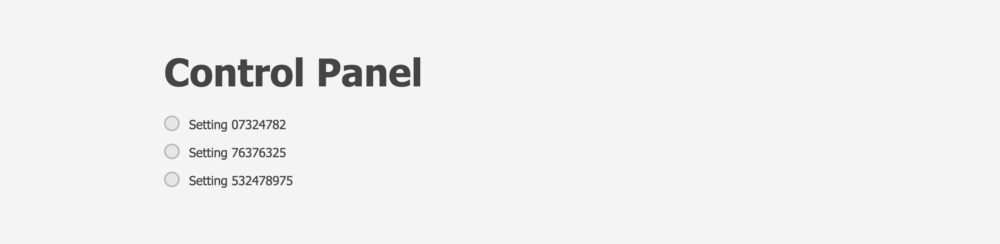
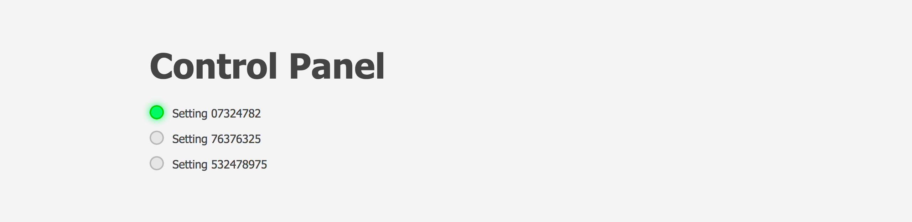
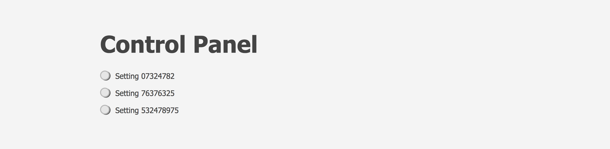
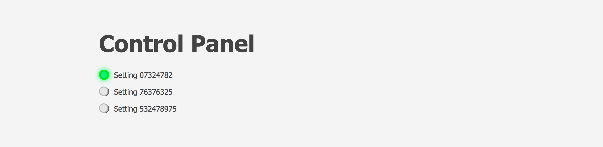
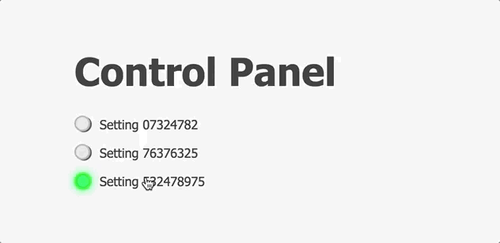

# Custom inputs

Extra:

Add an effect of the button being pushed:

The circle that appears around the mouse coursor comes from the gif itself and indicates where the click happens - it is **not** to be implemented.